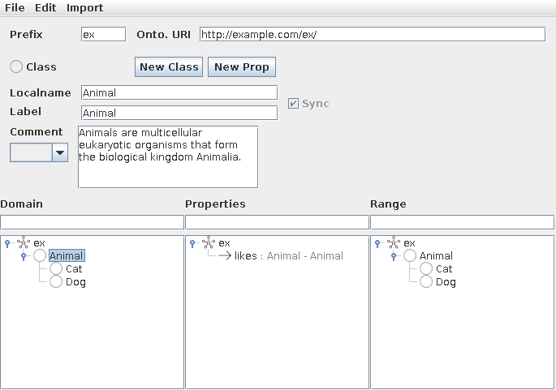

# Simple RDFS Editor

[Protégé](https://protege.stanford.edu/) is a powerful and commonly used editor to create and maintain [OWL](https://www.w3.org/TR/owl-ref/) ontologies. However, as soon as one would like to model less expressive [RDFS](https://www.w3.org/TR/rdf-schema/) ontologies, Protégé offers too many features where most of them are not needed and which rather tend to distract ontology engineers in designing simple ontologies.
That is why I decided to implement Simple RDFS Editor which is a simplified editor just to met the requirements for creating and maintaining RDFS ontologies.
It is open-source, written in Java 8 and currently in the alpha phase.

## Tutorial: how to use the tool

In this section I cover all features of the tool and how you use them.

### Ontology Prefix and URI

Choose a prefix and a namespace for your ontology. When the ontology is saved to file,
the tool uses the prefix for the file name, e.g. `msco.ttl`.

### Create Classes and Properties

When the text fields are blue, you create a fresh class resp. property.
Click on `New Class` (or press `Control+K`) or `New Prop` (or press `Control+B`) to get into this mode.
If you hold `Control` while clicking, the text fields are not reset and thus can be reused.
In any case the label text field is automatically focused.
The `Sync` feature, by default enabled, synchronizes label and localname while typing.
I recommend to enter always the label and let the localname be generated, e.g. when you write `price in $`
the tool generates the localname `priceIn%24` using camel case and URL encoding.
Use the dropdown-list to select the language tag that should be assigned to label and comment.

Press `Enter` in localname or label text field to create the resource.
Press `Control+Enter` in comment text field to achive the same.
However, press `Control+Enter` in localname or label text field to directly enter another resource.
This is handy for entering in bulk.
The resource is always added as top level concept.

After the resource is created, the text fields' background become white.
You now focus the resource and can edit all three aspects: localname, label and comment.
By switching the language tag with the dropdown-list, you can enter texts in other languages.

#### Property Creation with Domain and Range

Drag a class from the domain tree and drop it on a class from the range tree.

This creates a property and automatically labels it "has " + localname of the range class.
The created property is focused, so you could change its label directly.

#### Edit Property's Domain and Range

In order to reset the domain of a selected property press `Control+D`.
In order to reset the range of a selected property press `Control+R`.

However, you can also update the domain and range by drag&drop from the corresponding class tree.

### Class and Property Taxonomy

There are three trees: domain, properties and range tree.
They show the localname of the resource.
Domain and range class trees are mirrored to allow domain and range editing as stated above.
Use drag&drop in the trees to build the taxonomy resulting in subClassOf resp. subPropertyOf relations.

For properties, their domain and range are additionally shown in gray.
If domain or range is not defined, you see an empty set sign `∅`.
Once a property is selected having domain and range, the classes are highlighted
in green in the corresponding trees.

### Remove Classes and Properties

Select a class or property of your ontology in the tree and press `Delete`.
In order to remove imported ontologies, select their tree node and also press `Delete`.

### Import Other Ontologies

You can import other ontologies and reuse their classes and properties.
Imported ontologies can not be changed.

This is possible by loading them from file.
The following ontologies are shipped within the editor:
* [XML Schema Definition Datatypes](https://www.w3.org/TR/xmlschema11-2/) (XSD)
* [Friend of a Friend](http://xmlns.com/foaf/spec/) (FOAF)
* [DC Terms](http://dublincore.org/specifications/dublin-core/dcmi-terms/2012-06-14/?v=terms) (DCT)

XSD is useful when defining datatype properties, e.g. hasName with range xsd:string.

Classes and properties can be reused from imported ontologies using drag&drop.
You recognize imported resources by the attached ontology prefix.

### New, Open and Save

`New` resets everything in order to start a fresh ontology.
`Open` loads an RDFS ontology from file. The following formats are tried in this order: "TURTLE", "N-TRIPLE", "N3", "RDF/XML".
`Save` saves your ontology in turtle format. If a file was not selected yet, a file chooser pops up.
Look at the application's title to see in which file the ontology is stored.

## Accepted Limitations of the Tool

* No multi-inheritance with subClassOf and subPropertyOf
* No multiple domains or ranges
* One label and comment for each language tag
* Edit only one ontology at the same time

## TODOs

* Use Wikipedia, Wiktionary and other sources to autocomplete class and property creation
* Filter Domain, Properties and Range Tree by using the text field above
* Allow [Datatype](https://www.w3.org/TR/rdf-schema/#ch_datatype) creation
* Suggested translation in other languages for label
* Fix focus cycle among localname, label and comment text field
* Configurable language tag list
* Support undo and redo
* When class is removed also reset domain or range of properties if they refer to the class
* Support seeAlso and isDefinedBy
* json-ld ontology loading
* maybe allow saving ontology in other formats then turtle
* always sort the resources in the tree by localname
* maybe show label in trees if available instead of localname
* publish and versioning mechanism

## Contribution

If you find a bug, create an issue for it.
In case you would like to contribute, feel free to contact me.
The GUI of the tool is created with netbeans 11.0.
